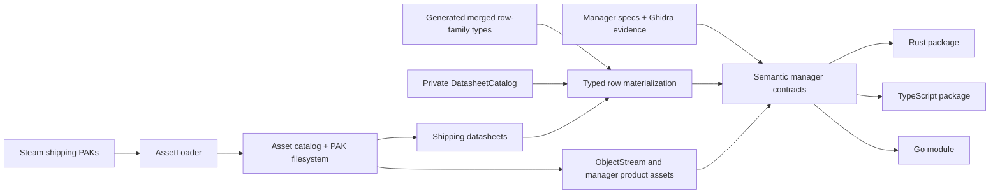

# GameData SDK Codegen

`nw-gamedata-codegen` emits self-contained Rust, TypeScript, and Go packages
that read New World shipping assets directly. Generated packages do not depend
on a game project, Bevy, a cooked asset cache, RON sources, or generated
physical-table modules.

## Architecture



The three language emitters consume the same schema and manager contract IR.
They may differ in syntax and language-level error handling, but not in manager
coverage, lookup policy, validation, source identity, or product decoding.

## Merged schemas and semantic rows

A generated schema describes a logical row family, not one physical datasheet.
For example, every datasheet whose row type is `DamageData` contributes columns
to one generated `DamageDataSchemaRow`. A manager still retains the typed
physical table identity on each `RowRef`/`RowSlot`, so serialized references can
select a specific damage table without requiring a row type per table.

Physical tables in one family can encode the same logical column differently.
Schema merging chooses a lossless common representation (`string` before
`number`, `number` before `boolean`), and each language adapter converts the
physical cell into that representation. The conversion belongs to schema-row
materialization; callers never inspect dynamic cells.

Semantic managers then apply the stricter native contract. They may reject or
skip rows that are valid schema rows but not valid members of that semantic
index. For example, `AbilityDataManager` only indexes rows with exact `u8`
`TreeID` and `TreeRowPosition` values, while `LevelDisparityDataManager` uses a
signed `i32` key. Rust, TypeScript, and Go must make the same decision for every
row.

## Private standalone datasheet catalog

A shipping `.datasheet` stores physical columns and rows, but it does not name
the generated merged DTO that should materialize those cells. The standalone
packages therefore embed one private `DatasheetCatalog`. Each entry binds a
physical table name and its catalog-relative source paths to:

- the merged logical `row_type`;
- the ordered column names and CRCs; and
- the column selected as that physical table's row key.

This is decoder metadata, not generated table code and not a public lookup API.
It allows the loader to map positional shipping cells into the correct merged
schema row without guessing from paths or non-empty rows. The generated schema
types remain the public row contract; physical table identity remains on typed
table and row handles.

The catalog exists only in standalone packages that read shipping
`.datasheet` assets. Repo-integrated GameData does not use it: every authored
RON table declares `name`, `schema`, and `key`, and the engine asset catalog
discovers built products. The integrated path therefore has no datasheet
catalog, table manifest, source index, or generated physical table module.

## Public contract

Every generated package has the same conceptual layers:

1. `AssetLoader` opens the New World `assets` directory, mounts PAKs, reads the
   asset catalog, and supports every cataloged asset. Oodle support is bundled
   as a package runtime dependency, not exposed as a GameData-specific helper.
2. `Managers` is a lazy, concurrency-safe registry. Opening it loads only the
   private datasheet catalog. Each concise accessor loads that manager's tables
   and products, constructs its dependency subgraph, and caches either the
   completed manager or its load failure.
3. A direct table manager exposes a typed table identifier and its merged
   generated schema row. Tables with the same row family share one row type.
4. A semantic manager performs its validity rules, duplicate policy,
   projections, derived values, and secondary indexes during construction. Its
   `rows` contract yields semantic DTOs, not raw cells.
5. Typed table and source handles remain available where serialized assets
   carry a physical table path, row key, or table-relative slot. Bare strings
   never select an arbitrary table.

Manager access and semantic lookup have separate failure channels. Accessors
return or throw `ManagerLoadError` when assets cannot be read or decoded;
lookups use `Option`, `undefined`, or `(nil, false)`-style results when a valid
manager simply has no matching row. A missing key is not reported as an asset
load failure.

Public manager names omit redundant native framing: `AbilityDataManager` is
reached through `ability`, `PlayerDataManager` through `player`, and
`StaticBackstoryDataManager` through `backstory`. Dependency names remain
descriptive inside generated implementations.

There is no public dynamic row/cell escape hatch and no parallel GameData-only
asset loader.

## Generation

```powershell
cargo run -p nw-gamedata-codegen --bin nw-gamedata-codegen -- `
  --assets "E:\Games\steamapps\common\New World\assets" `
  --output C:\Temp\new-world-gamedata
```

Omit the language option to emit all three packages in one catalog/schema pass,
or pass `--language rust`, `--language typescript`, or `--language go`.
Language is the only target choice. Every selected language always receives the
complete asset loader, private datasheet catalog, merged schemas, typed table
handles, and semantic managers; there are no profiles, optional products,
manager-only modes, placeholders, or compatibility output paths.

## Usage shape

Rust:

```rust
use new_world_gamedata::managers::Rows;

let loader = new_world_gamedata::AssetLoader::open(asset_dir)?;
let managers = new_world_gamedata::Managers::new(&loader);
let abilities = managers.ability()?;

for ability in abilities.rows() {
    println!("{}: tree {} row {}", ability.key, ability.tree_id, ability.tree_row_position);
}

let damage = managers.damage()?;
let referenced = damage.resolve(new_world_gamedata::managers::TableReference::new(
    "sharedassets/springboardentitites/datatables/javelindata_damage_sword.datasheet",
    "LightAttack1",
));
```

TypeScript:

```ts
await using loader = await AssetLoader.open(assetDir);
const managers = await Managers.open(loader);
const abilities = await managers.ability();

for (const ability of abilities.rows()) {
  console.log(ability.key, ability.treeId, ability.treeRowPosition);
}

const damage = await managers.damage();
const referenced = damage.resolve({ path: damageTablePath, key: "LightAttack1" });
```

Go:

```go
loader, err := assets.Open(assetDir)
if err != nil { return err }
defer loader.Close()

all, err := managers.New(loader)
if err != nil { return err }

abilities, err := all.Ability()
if err != nil { return err }
for ability := range abilities.Rows() {
    fmt.Println(ability.AbilityID, ability.TreeID, ability.TreeRowPosition)
}

damage, err := all.Damage()
if err != nil { return err }
referenced := damage.Resolve(managers.TableReference{Path: damageTablePath, Key: "LightAttack1"})
```

String and lowercase-CRC lookup methods are both available where the source
manager supports name hashing. Table-sensitive references use generated table
types, so a row from one physical table cannot silently resolve against another.
`TableReference` is the boundary type for ObjectStream/DynamicSlice references
that arrive as a full physical datasheet path plus row key. Direct managers
resolve it to a generated schema row; semantic managers such as damage resolve
it to their projected semantic type.

Rust and TypeScript expose immutable references/frozen DTOs. Go iterators yield
values, and pointer-returning optional lookups return defensive copies rather
than pointers into manager-owned slices.

## Validation gates

A codegen change is complete only when:

- every validated manager surface has a complete contract in all languages;
- the Rust, TypeScript, and Go `Managers` facades expose the same normalized
  manager accessor set;
- generation succeeds against the shipping Steam PAKs;
- generated Rust passes `cargo check --all-targets` with warnings denied;
- generated TypeScript passes separate `tsc --noEmit` and VitePlus build steps;
- generated Go passes `gofmt` and `go test ./...`;
- tree-sitter parses every generated source file; and
- each language opens the real asset directory, lazily constructs requested
  managers and their dependency subgraphs, and returns matching non-empty
  representative semantic results; and
- generated public code contains no abandoned loader, cooked-runtime, or
  implementation-history API markers.
